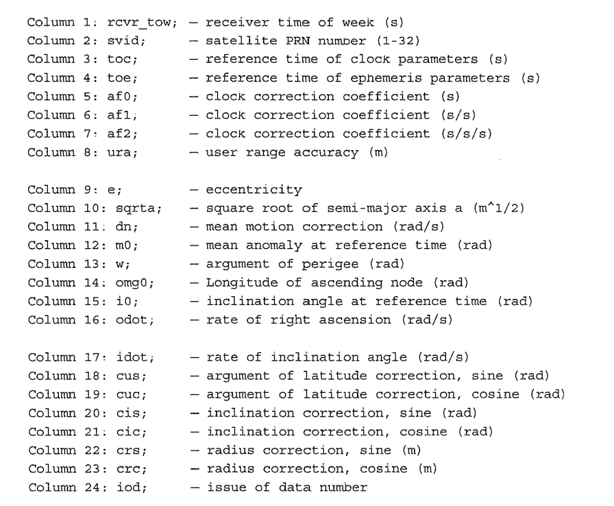
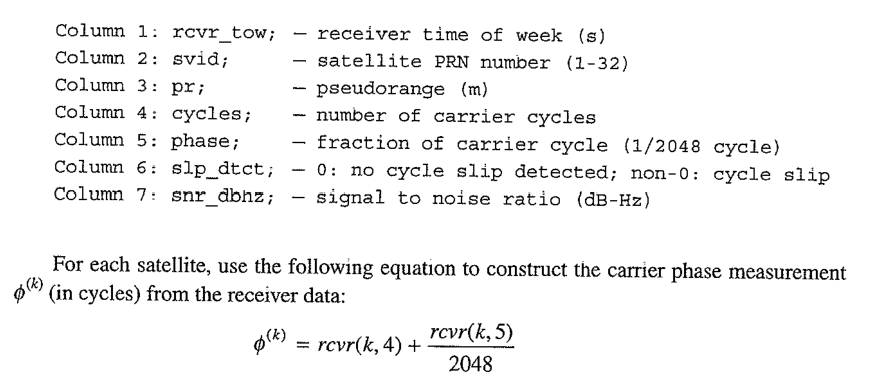

## About Navigation data and observation data 
### Navigational/ephemeris data
* The Nav/ephemeries data contains the number of tracked satellite  each with a data associated with it which is displayed in the 24 column in the image displayed below [ephemeris data](#nav-data-image) . Hence an N-number of satellites $\times$ Column informaton matrix in the ephemeries data file is formed. see the explanation to each column in the nave file in the image below [ephemeris data](#nav-data-image) . 
  
### Observational/Receiver data
* The received observational file also contain the number of satellites tracked with an associated pseudoranges, cycle slip, etc. that is what is displayed in the 7 column in the image below[observational data](#rcvr-data-image). Hence an N-number of satellites $\times$ Column informaton matrix in the observational data file is formed.  see the explanation to each column in the observational file in the image below [observational data](#rcvr-data-image) . 
  

  <figure id='nav-data-image'>
<figurecaption>Picture of the Explained columns of the nav data</figurecaption>

</figure>

<figure id='rcvr-data-image'>
<figurecaption>Picture of the Explained columns of the observaional data</figurecaption>

</figure>
